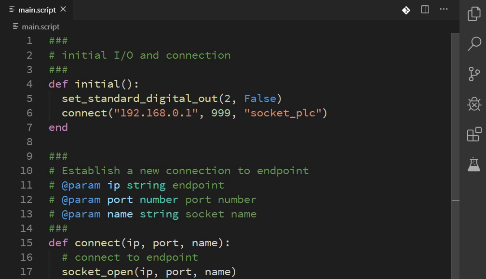
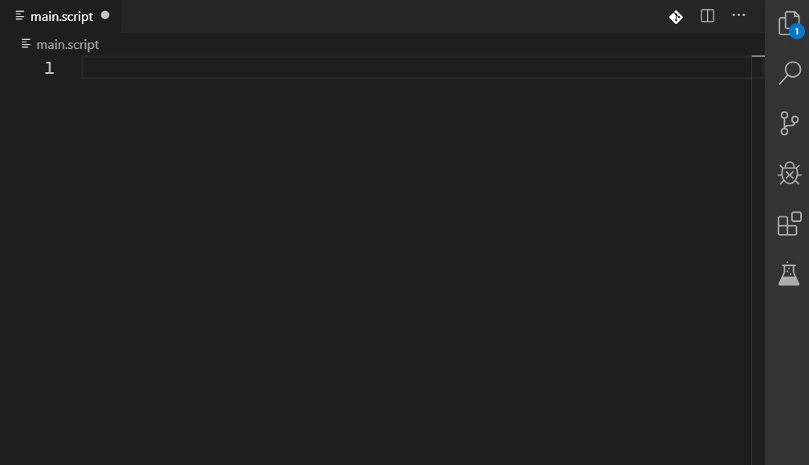
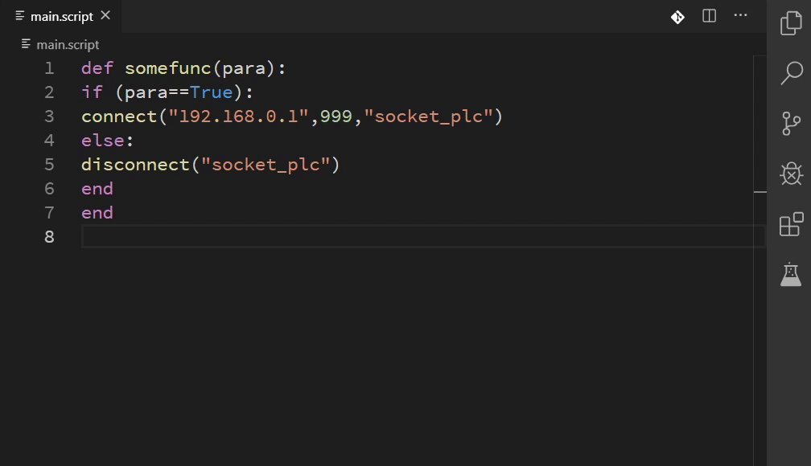
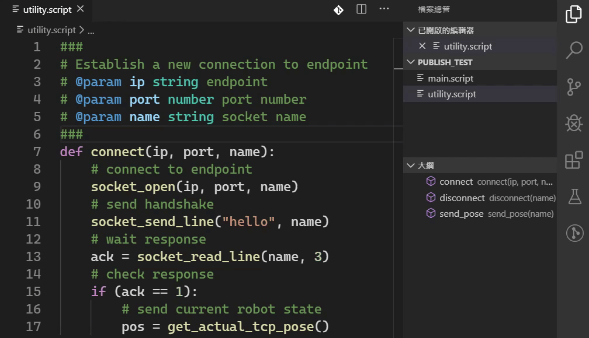

## urscript-extension

[繁體中文](README_zhTW.md)

This is a Visual Studio Code extension that built for **[Universal Robots](https://www.universal-robots.com/)™ Script** language.

This extension provides a simple coding environment with VSCode that more easily use than simulator.

## Notice

- Compiler, syntax check are **NOT** includes. You should upload program to controller or simulator for compile and execute.
- This extension **WITHOUT** LSP (Language Server Protocol)
- Below option will be modified after extension activated
  - `editor.tabSize: 2`
  - `editor.insertSpaces: true`
  - `files.eol: '\n'`

## Features

- Completion and signatures
  - Base on official scriptManual.pdf
    

- Show tips when mouse hover
  - Contains official and user defined
    

- Code snippets
  - def, if and others
    

- Formatting
  - Indents, add spaces
    

- Go to definition
  - Go to (`F12`) and preview functions
    

- Symbols and outline
  - Go to symbol (`CTRL + SHIFT + O`) and outline information
    

## Version

Please refer to [change logs](CHANGELOG.md) for detail changes.

## Installation

You can download latest .vsix from [release page](https://github.com/ahernguo/urscript-extension/releases).

Or to install the latest commits from `master` branch, compile it into the VSIX code and then side load it into VSCode.

1.  `npm install -g vsce` to make sure you have vsce installed globally
2.  `git clone https://github.com/ahernguo/urscript-extension` to clone the repo if you havent already done so
3.  `cd urscript-extension`
4.  `npm install` to install dependencies if you havent already done so
5.  `vsce package` to build the package. This will generate a file with extension vsix
6.  Open VSCode and Run the command Extensions: Install from VSIX..., choose the vsix file generated in the previous step
